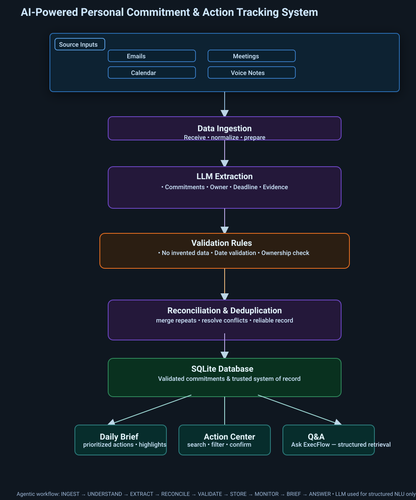

## ExecFlow System Architecture

The diagram below shows the ExecFlow agentic pipeline as a top-to-bottom data flow. It emphasizes deterministic validation rules, LLM-backed extraction for NLU, reconciliation and deduplication for data quality, and a single structured storage (SQLite) that feeds three user-facing outputs: Daily Brief, Action Center, and Q&A.

Rendered diagram (SVG):

If you prefer the Mermaid source for quick editing, it's still available further down in this file.

### Notes
- The design is intentionally agentic: each stage has a specific responsibility so that outputs are auditable and deterministic where necessary (e.g., validation and date resolution).
- The LLM is used for NLU (structured extraction) only; business rules, reconciliation, and date logic are deterministic and implemented in code for traceability.
- The central SQLite database stores validated records and supports the Daily Brief, Action Center, and Q&A (Ask ExecFlow) features.

If you want, I can also render this as an SVG and add it directly to this repo (for slides or a PDF). Reply with the preferred format: `SVG`, `PNG`, or `draw.io`.

# ExecFlow Architecture

## Overview

ExecFlow is designed to ingest operational inputs from several channels and apply lightweight
guidance rules to transform them into structured, action-focused output.

## Components

### Application layer
The `app.py` file initializes the data store and execution agent.

### Agent layer
The `agent.py` module defines the main agent behavior, including data ingestion and processing.

### Storage layer
The `database.py` file keeps a simple in-memory record of imported notes by source.

### Rule layer
The `rules.py` file contains a set of reusable text processing rules for normalization and simplification.

### Prompt layer
The `prompts.py` file contains the system prompt used to guide the workflow.

## Intended workflow

1. Read one or more source text files from `data/`.
2. Store each input by source name.
3. Apply transformation rules to reduce noise and duplicate content.
4. Summarize and produce execution-oriented output.

## Extension ideas

- Add structured parsing for action items and deadlines.
- Integrate with calendar, email, or voice APIs.
- Add a web interface or REST API.
- Persist data to SQLite or Postgres for long-term storage.
